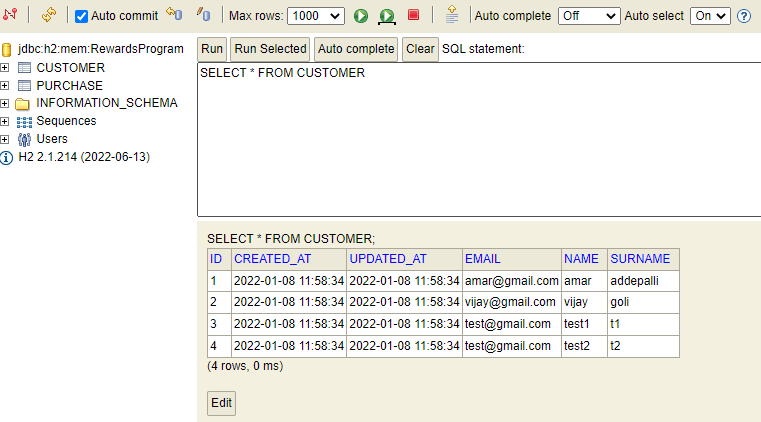
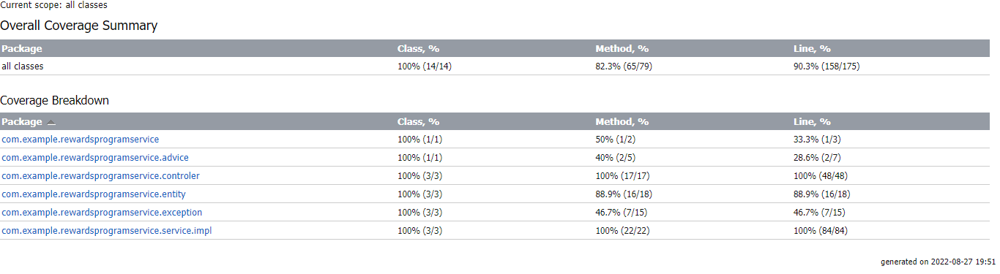

# RewardsProgramService
A retailer offers a rewards program to its customers, awarding points based on each recorded purchase.

A customer receives 2 points for every dollar spent over $100 in each transaction, plus 1 point for every dollar spent over $50 in each transaction
(e.g. a $120 purchase = 2x$20 + 1x$50 = 90 points).

For the last 3 months period, calculate the reward points earned for each customer per month and total.

## Dependencies
There are a number of third-party dependencies used in the project. 
Browse the Maven pom.xml file for details of libraries and versions used.
Some of them are 

* SpringBoot: 2.7.3
* SpringBoot Data JPA
* Lombok
* H2 database
* Mockito, Junit

## Building the project
You will need:

*	Java JDK 8 or higher
*	Maven 3.8.5 or higher
*	Git

Clone
--------

```sh
git clone https://github.com/gopikrihnaus/RewardsProgramService.git
```

Run
--------

```sh
cd RewardsProgramService
mvn clean install
mvn spring-boot:run
```

Access
--------

### Select

```
http://localhost:8080/rewards/1/lastThreeMonth
```
JSON Response:

```json
{"June":90.0,"July":90.0,"August":80.0,"Total":260.0}
```

H2-Console:

Access the H2 console with below link

```
http://localhost:8080/h2-console
```
change the JDBC URL to 
```
jdbc:h2:mem:RewardsProgram
```
Rewards program will load some tets data into H2 DB



Access the customers in side the DB

```
http://localhost:8080/customer/
```
JSON Response:

```json
[{"createdAt":"2022-01-08T17:58:34.000+00:00","updatedAt":"2022-01-08T17:58:34.000+00:00","id":1,"name":"amar","surname":"addepalli","email":"amar@gmail.com"},{"createdAt":"2022-01-08T17:58:34.000+00:00","updatedAt":"2022-01-08T17:58:34.000+00:00","id":2,"name":"vijay","surname":"goli","email":"vijay@gmail.com"},{"createdAt":"2022-01-08T17:58:34.000+00:00","updatedAt":"2022-01-08T17:58:34.000+00:00","id":3,"name":"test1","surname":"t1","email":"test@gmail.com"},{"createdAt":"2022-01-08T17:58:34.000+00:00","updatedAt":"2022-01-08T17:58:34.000+00:00","id":4,"name":"test2","surname":"t2","email":"test@gmail.com"}]
```

Access the Purchases in side the DB

```
http://localhost:8080/purchase/
```
JSON Response:

```
[{"createdAt":"2022-06-08T16:58:34.000+00:00","updatedAt":"2022-06-08T16:58:34.000+00:00","id":1,"details":"Grocery","amount":120.0,"customer":{"createdAt":"2022-01-08T17:58:34.000+00:00","updatedAt":"2022-01-08T17:58:34.000+00:00","id":1,"name":"amar","surname":"addepalli","email":"amar@gmail.com","hibernateLazyInitializer"}}]
```

All the CRUD operations and Endpoints are provided for Customers and Purchases.
Please check the code for more details.
### Code Coverage
I have used the Intelij plugin for running the code coverage, 
please see the below image.

The code coverage rate is 89%.


